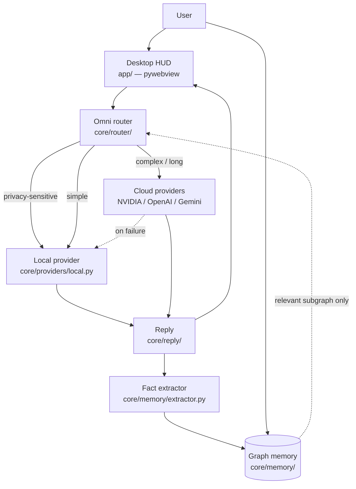

# Architecture

SACHA V3 is built around five layers, each mapped to a top-level folder.

## Folder → layer mapping

| Folder                | Layer                                          |
| --------------------- | ---------------------------------------------- |
| `app/`                | Desktop HUD — pywebview window + static UI     |
| `core/router/`        | OmniRouter + classifier + provider fallback    |
| `core/providers/`     | ModelProvider interface + concrete providers   |
| `core/memory/`        | Graph store + background fact extractor        |
| `core/reply/`         | Reply composition + streaming                  |
| `core/conversation/`  | Short-term in-session history                  |
| `core/tools/`         | Tool registry + built-in tools + plugin host   |
| `voice/`              | STT / TTS / wake word / barge-in               |
| `vision/`             | Gesture, air-draw, (planned) VLM               |
| `personality/`        | SOUL.md loader + presets + version history     |
| `scheduler/`          | apscheduler wrapper + natural-language parser  |
| `bridges/`            | Telegram / Discord / Slack messaging bridges   |
| `plugins/`            | User-authored skill loader + sandbox           |
| `data/`               | Local SQLite + cache (gitignored)              |

## Why this design

V3 fixes the two structural flaws of V1/V2:

1. **No more browser round-trip.** The HUD is a native pywebview window —
   the backend is in-process, the event loop is shared, and voice latency
   is bounded by the OS audio stack instead of a network hop.
2. **No more full-context resend.** Long-term memory is a graph; only the
   relevant subgraph enters context per query, so token usage stays flat as
   history grows.

Provider selection is automatic via `OmniRouter`, and any provider failure
falls back to the next one in the chain (cloud → local) instead of crashing
the request.

See `providers.md`, `plugins.md`, `bridges.md`, and `packaging.md` for
sub-system specifics.